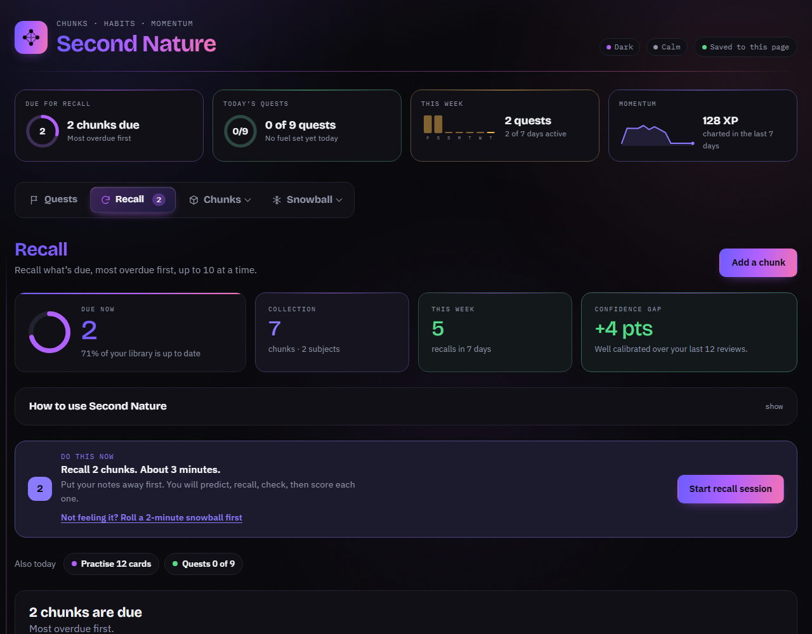
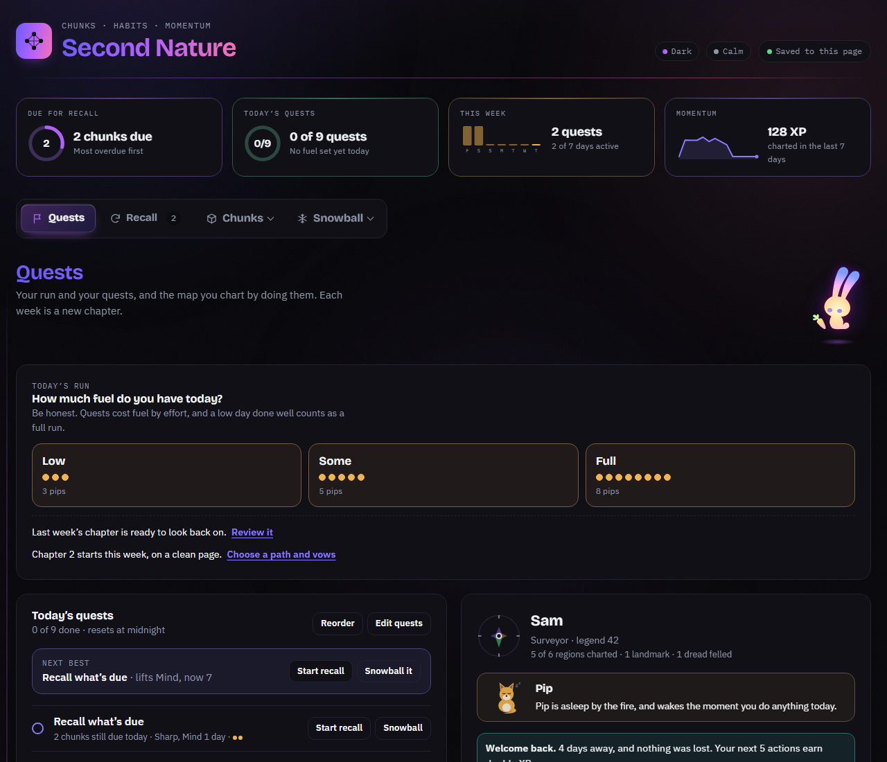

# Second Nature

A single-file learning app: build **chunks** of what you learn, recall them on a spaced schedule, turn what you know into habits, and keep the daily momentum going with quests and a two-minute starter.

Everything is one HTML file (`second-nature.html`). Open it in a browser and it works, saving to that browser. Publish it as a [Claude artifact](https://claude.ai) and it gets a shared database, syncs between your devices, and can ask Claude to check your recall.

## What's inside

| Section | What it does |
|---|---|
| **Recall** | The cards due today, most overdue first. Predict how well you'll do, recall with nothing open, reveal your notes, score yourself. Relearn on the spot when you blank. A session you leave part-way is saved and resumed. |
| **Chunks → Capture** | Jot ideas while you read, then turn one into a chunk in your own words. |
| **Chunks → Collection** | Every chunk you've built: search, filter by subject, edit, practise its cards, and see the web of links between them. |
| **Chunks → Traits** | Tie a technique to a moment in your day and practise it until it's automatic. |
| **Chunks → Progress** | Does your confidence match your recall? What should you practise next? |
| **Chunks → Method** | The five-stage chunk system the app is built on, as a reference page. |
| **Quests** | Daily quests with fuel, streaks, chapters and expeditions, a map you chart by doing them, and a journal that keeps what you've done. |
| **Snowball → Starter** | Can't get going? A two-minute push. Each win makes the next one a little longer. |
| **Snowball → Motivation** | What drives motivation, what to do the moment you're stuck, and how strong the evidence is behind each tool. |

Review gaps start at 1, 2, 4, 9, 19, 55 and 180 days. **Cold** moves a chunk to the next gap, **Fragments** steps back one, **Blank** starts again at one day, and **Mostly** holds the gap it's on. From there each chunk drifts to its own pace.

The app ships with nine starter chunks from *Learning How to Learn* (Barbara Oakley and Terrence Sejnowski), so Recall has something to do on day one. Delete them once you have your own.

## Run it

**On its own.** Open `second-nature.html` in a browser. Everything is stored in that browser's local storage. The backup buttons at the bottom of Recall save and restore a JSON file, so you can move between browsers.

**As a Claude artifact.** Publish the file as an artifact with these capabilities:

- `db` — a shared document database, so your data lives with the page and follows you between devices.
- `user` — your private folder in that database, used to sync a paused recall session between devices.
- `sample` — lets the Recall page ask Claude to check what you typed against your notes. Optional; the page works without it.
- `downloads` — the backup buttons.

The page checks for each capability at load and quietly falls back when one is missing, so it also runs fine with none of them.

## Make it yours

The file is plain HTML, CSS and JavaScript with no build step and no dependencies beyond two Google Fonts links.

- **Colours and type:** the tokens at the top of the `<style>` block (`:root`, then the dark and light overrides).
- **Starter chunks:** the `STARTERS` array near the top of the main script. Replace them with your own subject, or empty the array.
- **Quests:** `DEFAULT_QUESTS` in the main script, seeded once into a fresh database.
- **Review gaps and scores:** `GAPS`, `PRED` and `SCORES`, next to `STARTERS`.
- **Method and Motivation pages:** two `<template>` blocks (`methodTpl`, `motivTpl`) rendered into shadow roots, each with its own CSS. Edit the copy there.
- **Snowball:** the `snowTpl` template and the last `<script>`.

The main script is written in plain ES5-style JavaScript with no framework: one state object (`S`), one for the quests game (`G`), a `store` object that talks to either the artifact database or local storage, `renderAll()` to redraw, and one delegated click handler that dispatches on `data-act` attributes.

## Privacy

Nothing leaves the page unless you publish it as an artifact, in which case your data lives in that artifact's database under your Claude account. There is no analytics and no third-party script. The only outside requests are the two font stylesheets.

## Contributing

Issues and pull requests are welcome. Keep changes small and self-contained, and check the page still opens on its own (no artifact) after your change.

## Licence

MIT. See [LICENSE](LICENSE).
